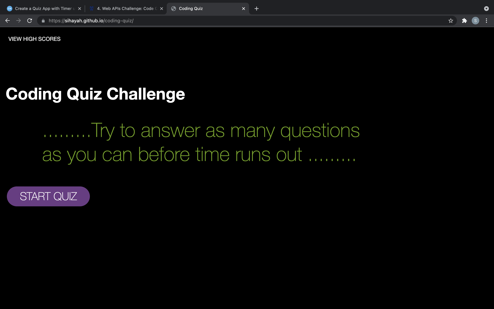

# CODE QUIZ

https://sihayah.github.io/coding-quiz/

This is a coding quiz application composed with dynamically generated elements created primarily in JavaScript with CSS style. 

User is prompted to start quiz via a start-button. Then a series of questions are asked. Upon answering, user can see whether their answer was correct or incorrect. Each correct answer adds a point to the users score. 

When the timer runs out, the user is can submit their initials into a form to save their highscore.
